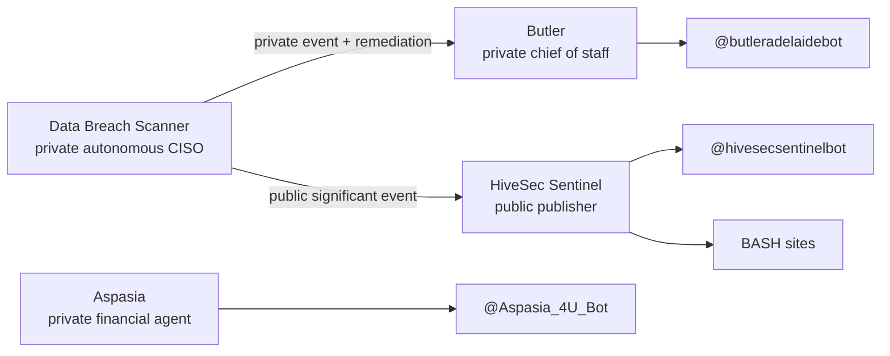

# Private/public assistant ecosystem

## System goal

Keep private assistance, financial execution, intelligence collection and
public security publishing in separately credentialed projects.

## Ownership

| Project | Owns | Must never own |
|---|---|---|
| Butler | Personal context, Cyber Radar, private remediation delivery | Public publishing, trading credentials |
| Data Breach Scanner | Discovery, normalization, correlation, triage, outboxes | Telegram, Grok, GitHub/site credentials |
| HiveSec Sentinel | Public editorial synthesis and delivery | Victim identities, private outbox, financial data |
| Aspasia | Revolut X analysis/execution and financial alerts | Cyber/public publishing data |

## Event contracts

- Private path: versioned JSON, `classification=private`, may contain the
  monitored identity, consumed only by Butler.
- Public path: versioned JSON, `classification=public`, must not contain
  `victim`, consumed only by HiveSec Sentinel.
- Both consumers reject unsafe files and move an event only after delivery.
- Public dual delivery records per-channel progress to avoid repeating a
  successful channel after the other fails.

## Credential namespaces

- Butler: `com.butler.telegram`
- HiveSec: `com.hivesec.telegram`, `com.hivesec.xai`, `com.hivesec.github`
- Aspasia: `com.raf.aspasia.telegram`
- Scanner: source credentials only; no presentation-channel credential

No token should be copied between these namespaces or committed to Git.
